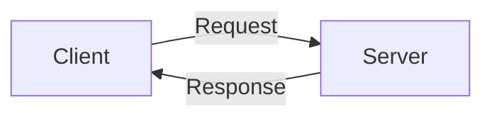
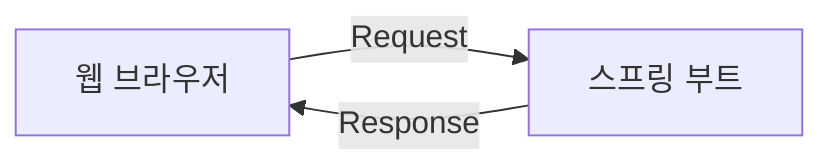

# 스프링 부트 개요와 MVC 패턴 이해

## 1. 스프링 부트란?
**스프링 부트 (Spring Boot)** : 웹 애플리케이션을 쉽고 빠르게 만들 수 있도록 도와주는 자바의 웹 프레임워크로 스프링(Spring) 프레임워크에 톰캣(Tomcat)이라는 서버를 내장하고있다.
 > **웹 프레임워크 (Web Framework, WF)** : 웹 서비스 개발 보조용으로 만들어지는 애플리케이션 프레임워크의 일종으로, 웹 페이지를 개발하는 과정에서 겪는 어려움을 줄이는 것이 주된 목적이다. 통상 데이터베이스 연동, 템플릿 형태의 표준, 세션 관리, 코드 재사용 등의 기능을 포함하고 있다.

<br>

 > **톰캣(Tomcat)** : 클라이언트의 요청을 해석하여 그에 맞는 자바 프로그램을 실행한 후, 그 결과를 응답하는 웹 애플리케이션 서버

<br>

**스프링 부트의 특징**
- 비즈니스 로직에 집중할 수 있도록 개발 환경 설정을 간소화하였다. 미리 설정된 스타터 프로젝트로 빌드 도구 구성을 간소화하고 더 나아가 외부 라이브러리를 최적화하여 제공하기 때문에 사용자가 별다른 설정을 추가적으로 할 필요가 없다.
- 독립 실행한 애플리케이션 개발을 위하여 웹 애플리케이션 서버(Web Application Server, WAS)인 톰캣(Tomcat)을 내장하고 있다. 따라서 웹 서비스를 jar 파일로 간편하게 배포할 수 있다. 다만, war 파일이 아닌 jar 파일이기 때문에 JSP 파일이 지원되지 않으며 외장 WAS에 배포할 수 없다.

## 2. 웹 서비스 동작 원리 이해하기



**클라이언트 (Client)** : 서비스를 사용하는 프로그램 및 컴퓨터로 웹 브라우저가 클라이언트로서 동작한다.
**서버 (Server)** : 서비스를 제공하는 프로그램 및 컴퓨터로 스프링 부트가 서버로서 역할을 수행한다.



당연히도 클라이언트의 요청에 응답하기 위해서는 서버가 실행 중이어야만 한다. 따라서 스프링 부트 프로젝트를 종료하면 해당 사이트에 접근할 수 없다고 표시된다.  <br>
**웹 서비스는 서버를 실행해야만 웹 브라우저를 통해 접근 가능하다!** <br>

**```http://서버주소:포트번호```**
주소 표시줄을 보면 ```http://localhost:8080/hello.html```과 같이 표시된다. 

- **로컬 호스트 (localhost)** : 현재 사용 중인 컴퓨터를 가리킨다. 로컬 호스트를 사용하면 네트워크를 통해 외부 서버에 연결하지 않고도 현재 시스템에서 서비스를 실행할 수 있다.
- **포트 번호 (Port Number)** : 네트워크 통신에서 특정 프로세스를 식별하는 데 사용된다. 일반적으로 특정 포트에서 클라이언트 요청을 수신하여 웹 페이지를 제공한다. 즉 8080은 8080번 포트에서 웹 페이지를 제공하고 있다는 의미이다.
- **서버에 요청하는 파일** : ```localhost:8080```으로만 접속하면 에러 페이지가 뜬다. 따라서 뒤에 요청할 웹 페이지의 이름을 붙여야만 한다. 이렇게 파일을 직접 지정할 경우 스프링 부트는 기본적으로 **src>main>resources>static**디렉터리에서 파일을 찾는다. 추가로, 스프링부트는 웹 서버에 담겨져서 실행되기 때문에 8080번에서 톰캣이 수행되고 있는 셈이기도 하다.

## 3. 4. 뷰 템플릿 및 MVC 역할과 실행 흐름 이해하기

**뷰 템플릿 (View Template)** : 웹 페이지(View)를 하나의 틀(Template)로 만들고 더 나아가 해당 틀에 변수를 삽입해 서로 다른 페이지로 보여주는, 화면을 담당하는 기술이다.

**MVC 패턴 (Model-View-Controller Pattern)**
- **모델 (Model)** : 데이터를 관리하는 역할
- **뷰 (View)** : 화면에 표시하는 역할 (뷰 템플릿)
  - src > main > resources > templates
- **컨트롤러 (Controller)** : 클라이언트의 요청에 따라 서버에서 이를 처리하는 역할
  - src > main > java > com.example.firstproject > controller > FirstController
  - **컨트롤러임을 선언하는 @Controller 어노테이션 작성**

**뷰 및 모델 코드**
```
{{>layouts/header}}  
  <!--content-->  
  <div class="bg-dark text-white p-5">  
 // 5-1. 모델 추가 (형식->{{변수}})
 // 변수명을 사용하면 변숫값에 따라 결과가 다르게 출력됨 (템플릿화)
 <h1>{{username}}님, 반갑습니다!</h1>  
 </div>{{>layouts/footer}}
```

**컨트롤러 및 모델 코드**

```
// 1. 컨트롤러 선언과 함께 자동으로 임포트됨
import org.springframework.stereotype.Controller;  
// 5-2. Model 타입의 model 매개변수 추가하면서 Model 클래스 패키지가 자동으로 임포트됨
import org.springframework.ui.Model;  
// 4. @GetMappihng()추가와 함께 자동으로 임포트됨
import org.springframework.web.bind.annotation.GetMapping;  
  
// 1. 컨트롤러 선언
@Controller
public class controller {  
    // 4. 페이지(greetings.mustache) 반환을 요청하는 URL을 접수하는 부분 추가
    // "/hi"->URL 주소
  @GetMapping("/hi")  
    // 2. 메서드 작성 (niceToMeetYou())
    // 5-2. 모델 추가하기 (컨트롤러의 메서드에서 매개변수로 받아옴으로써)
    public String niceToMeetYou(Model model){  
        // addAttribute()를 사용하여 모델을 통해 변수 등록하기
        // model 객체가 값을 이름에 연결하여 웹 브라우저로 전송함
        model.addAttribute("username", "Y0-0N63");  
  // 3. greetings.mustache 파일 반환
  // 3. 파일 이름만 적어도 서버가 templates 디렉터리에서 파일을 찾아 웹 브라우저로 전송
  return "greetings";  
    }  
  }
```
