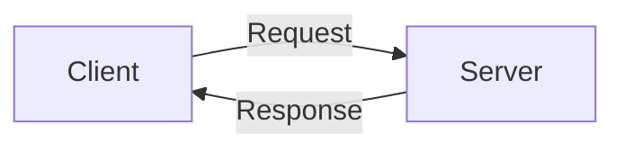
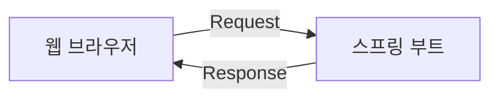

# 스프링 부트 개요와 MVC 패턴 이해

## 1. 스프링 부트란?
**스프링 부트 (Spring Boot)** : 웹 애플리케이션을 쉽고 빠르게 만들 수 있도록 도와주는 자바의 웹 프레임워크로 스프링(Spring) 프레임워크에 톰캣(Tomcat)이라는 서버를 내장하고있다.
 > **웹 프레임워크 (Web Framework, WF)** : 웹 서비스 개발 보조용으로 만들어지는 애플리케이션 프레임워크의 일종으로, 웹 페이지를 개발하는 과정에서 겪는 어려움을 줄이는 것이 주된 목적이다. 통상 데이터베이스 연동, 템플릿 형태의 표준, 세션 관리, 코드 재사용 등의 기능을 포함하고 있다.

 

 > **톰캣(Tomcat)** : 클라이언트의 요청을 해석하여 그에 맞는 자바 프로그램을 실행한 후, 그 결과를 응답하는 웹 애플리케이션 서버

 

**스프링 부트의 특징**
- 비즈니스 로직에 집중할 수 있도록 개발 환경 설정을 간소화하였다. 미리 설정된 스타터 프로젝트로 빌드 도구 구성을 간소화하고 더 나아가 외부 라이브러리를 최적화하여 제공하기 때문에 사용자가 별다른 설정을 추가적으로 할 필요가 없다.
- 독립 실행한 애플리케이션 개발을 위하여 웹 애플리케이션 서버(Web Application Server, WAS)인 톰캣(Tomcat)을 내장하고 있다. 따라서 웹 서비스를 jar 파일로 간편하게 배포할 수 있다. 다만, war 파일이 아닌 jar 파일이기 때문에 JSP 파일이 지원되지 않으며 외장 WAS에 배포할 수 없다.

## 2. 웹 서비스 동작 원리 이해하기

**클라이언트 (Client)** : 서비스를 사용하는 프로그램 및 컴퓨터로 웹 브라우저가 클라이언트로서 동작한다.
**서버 (Server)** : 서비스를 제공하는 프로그램 및 컴퓨터로 스프링 부트가 서버로서 역할을 수행한다.

당연히도 클라이언트의 요청에 응답하기 위해서는 서버가 실행 중이어야만 한다. 따라서 스프링 부트 프로젝트를 종료하면 해당 사이트에 접근할 수 없다고 표시된다.  
**웹 서비스는 서버를 실행해야만 웹 브라우저를 통해 접근 가능하다!**

## 3. 뷰 템플릿과 MVC 패턴
## 4. MVC 패턴을 활용하여 뷰 템플릿 페이지 만들기
## 5. MVC 역할과 실행 흐름 이해하기
